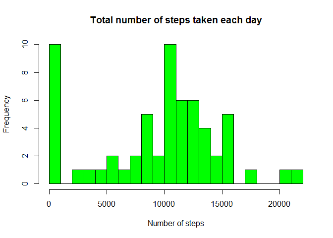
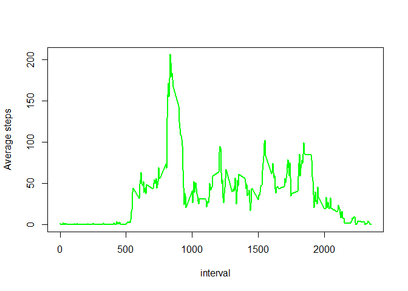
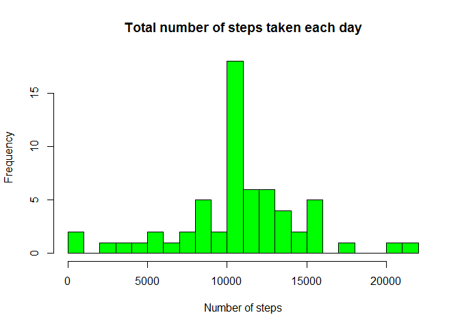
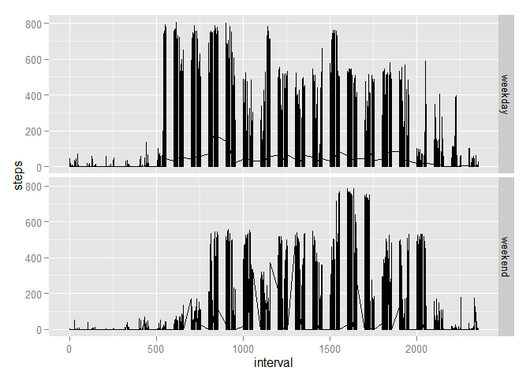

# Reproducible Research: Peer Assessment 1


## Loading and preprocessing the data

### loading the data


```r
temp <- tempfile()
download.file("https://d396qusza40orc.cloudfront.net/repdata/data/activity.zip",temp)
data <- read.csv(unz(temp, "activity.csv"))
unlink(temp)
```

### Preprocessing the data
Before begining the analysis we need to  Convert the date variable from character format to Date format. As we will use  mutate() verb from **dplyr**, we need first to load the package.


```r
library(dplyr)
```

Converting date from character to date format. To do this we save the data in a new data frame **mydf**

```r
mydf <- mutate(data, date = as.Date(strptime(date, "%Y-%m-%d"))) 
```

## What is mean total number of steps taken per day?

1. Number of steps taken per day.

We generate a data frame ** stepbydate ** with to variables *steps* and *date*. each observations consist of a date and the corresponding total number of steps.

```r
stepbydate <- mydf %>%group_by(date) %>% summarize(steps=sum(steps,na.rm=TRUE)) 
```

2. Make a histogram of the total number of steps taken each day. 

```r
 hist(stepbydate$steps, main = "Total number of steps taken each day", xlab='Number of steps', ylab="Frequency",col="green", breaks = 20) 
```

 
 

3. Mean and median of the total number of steps taken per day

```r
summarize(stepbydate, mean_steps=mean(steps,na.rm=TRUE), median_steps=median(steps,na.rm=TRUE))
```

```
## Source: local data frame [1 x 2]
## 
##   mean_steps median_steps
##        (dbl)        (int)
## 1    9354.23        10395
```

## What is the average daily activity pattern?

1. Time series plot of the 5-minute interval (x-axis) and the average number of steps taken, averaged across all days (y-axis)
To do this plot, we first generate a new data frame **mydf2**

```r
 mydf2 <- mydf %>% group_by(interval) %>% summarize(steps=mean(steps,na.rm=TRUE)) 
```

The we plot resulting time serie

```r
 plot(mydf2$interval, mydf2$steps, type = "l", lwd=2, col="green", xlab="interval", ylab="Average steps")
```

 


2. Interval on average across all the days in the dataset which contains the maximum number of steps
To answer to this question we use the select function from **sqldf** package. First we load the package

```r
library(sqldf)
```

We can then use **select()** function to find the maximum number of steps

```r
sqldf("select interval, max(steps) steps from mydf2")
```

```
## Loading required package: tcltk
```

```
##   interval    steps
## 1      835 206.1698
```

## Imputing missing values

1. Total number of missing values in the dataset 

```r
 nbna <- sum(!complete.cases(data))
```

2. & 3 - Strategy for filling in all of the missing values in the dataset

Here we answer at the same time to the second and the third questions. Here is our strategy:

 We choose to fill na's with the mean for that 5-minute interval. For each 5-minute interval, we compute the mean without missing values in all the dataset. The value obtained is use to fill missing values in the same 5-minute interval. 

```r
mydf3 <- mydf %>% group_by(interval) %>% mutate(filled_steps=mean(steps,na.rm=TRUE)) %>% transform(steps = ifelse(is.na(steps), filled_steps, steps)) %>% select(steps,date,interval)
```

4 -  Make a histogram of the total number of steps taken each day
We generate a data frame ** stepbydate ** with to variables *steps* and *date*. each observations consist of a date and the corresponding total number of steps.

```r
 stepbydate <- mydf3 %>%group_by(date) %>% summarize(steps=sum(steps,na.rm=TRUE)) 
```

Making the histogram of the total number of steps taken each day. 

```r
 hist(stepbydate$steps, main = "Total number of steps taken each day", xlab='Number of steps', ylab="Frequency",col="green", breaks = 20)
```

 

 Mean and median of the total number of steps taken per day

```r
summarize(stepbydate, mean_steps=mean(steps,na.rm=TRUE), median_steps=median(steps,na.rm=TRUE))
```

```
## Source: local data frame [1 x 2]
## 
##   mean_steps median_steps
##        (dbl)        (dbl)
## 1   10766.19     10766.19
```
 Now the mean and the median are the same : **10766.19** 
 These values differ from the estimates from the first part of the assignment wich were **9354.23 for the mean** and **10395 for the median**
 The median and the mean are moving to the right

## Are there differences in activity patterns between weekdays and weekends?
1 - Creating a new factor variable in the dataset consisting of two factors: *"weekend","weekday"*

```r
 mydf4 <- mydf3 %>% mutate(dayname=weekdays(date)) %>% mutate(isweekday=ifelse(dayname=="samedi"|dayname=="dimanche","weekend","weekday")) %>% select(steps,date,interval,isweekday)
```

2 - Panel plot of time series plot of the 5-minute interval  and the average number of steps
We first generate a new data frame **mydf5** with three variables: *steps* (mean of steps by interval), *interval* and *isweekday*

```r
  mydf5 <- mydf4 %>% group_by(interval,isweekday) %>% summarize(steps=mean(steps)) %>% select(steps,interval,isweekday)
```

As we will use **ggplot2** for this plot, we first need to load the package.

```r
 library(ggplot2)
```

Finally, we can make the plot

```r
 g <- ggplot(mydf4, aes(x = interval, y = steps, group = isweekday)) + geom_line() + facet_grid(isweekday ~ .)
 g
```

 

We find that there are differences in activity patterns. During weekdays, on average the number of steps are above 600. This is different from the weekend where just a few observations have  average number of steps above 600.
